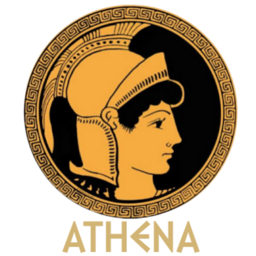
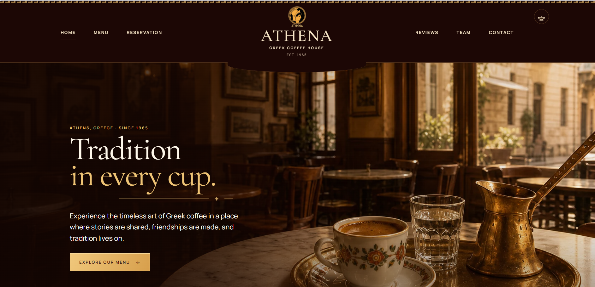
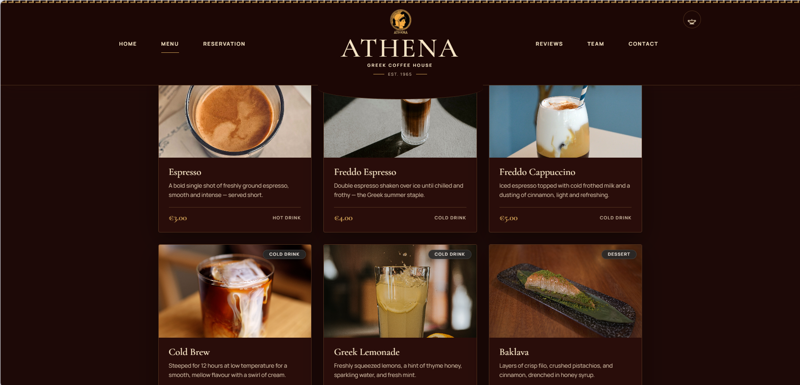
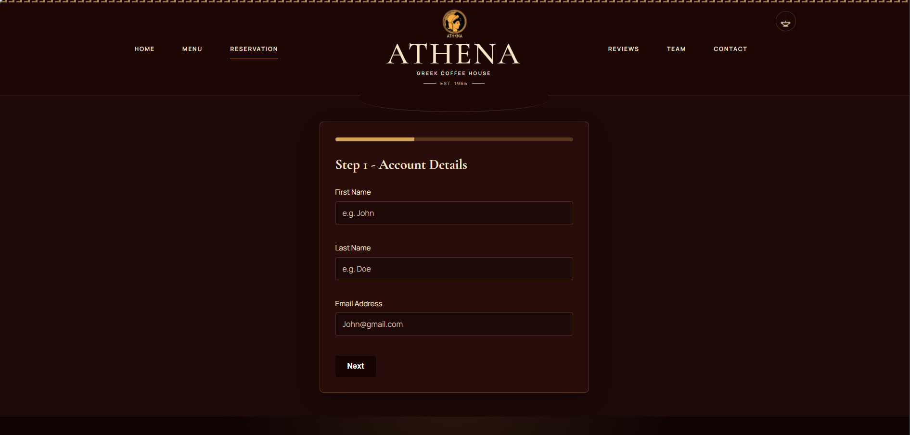

# Athena Greek Coffee House

[](https://developer.mozilla.org/en-US/docs/Web/HTML)
[](https://developer.mozilla.org/en-US/docs/Web/CSS)
[](https://developer.mozilla.org/en-US/docs/Web/JavaScript)
[](LICENSE)



A responsive, multi-page site for a Greek coffee house, built with vanilla HTML5, CSS custom properties, and native Web Components. Made for the WEB1201 final assessment.

## Preview (click to view) 

<details open>
<summary>Landing page</summary>
<br>

</details>

<details>
<summary>Menu</summary>
<br>

<p><i>Hot & cold drinks, daily pastries, baklava, and honeyed treats.</i></p>
</details>

<details>
<summary>Reservation & login</summary>
<br>

</details>

## Getting Started

This is a static site — no build step, no dependencies.

```bash
git clone https://github.com/muhammadabbas010/web1201-athena-cafe.git
cd web1201-athena-cafe
```

Open `index.html` directly in a browser, or serve it locally so relative paths and fonts load correctly:

```bash
npx serve .
# or
python3 -m http.server
```

## Features

- **Theme switcher** — dark/light mode via CSS variables, persisted in `localStorage`.
- **Fully responsive** — mobile-first layout using CSS Grid and Flexbox.
- **Custom Web Component** — a reusable `<site-footer>` element shared across every page instead of duplicated markup.
- **Multi-step reservation form** — 3-step flow with a progress bar and a login step that greets the user after validation.
- **Accessibility** — skip-navigation link, `aria-` labels throughout, and full keyboard navigation.

## Tech Stack

- **Frontend:** HTML5, CSS3 (Grid & Flexbox), JavaScript (ES6+)
- **Architecture:** Vanilla Web Components, no framework
- **Fonts:** Google Fonts (Cormorant Garamond, Manrope)
- **Logos:** Custom, by M. Abbas

## Project Structure

```text
WEB1201-Athena-Cafe/
├── assets/                    # Brand assets, logos, and menu images
├── css/
│   ├── styles.css             # Global stylesheet: layout, grids, variables
│   ├── register.css           # Reservation page
│   ├── menu.css                # Menu page
│   ├── contact.css             # Contact page
│   ├── reviews.css             # Reviews page
│   └── team.css                 # Team page
├── js/
│   ├── script.js               # Core interactivity & theme toggle
│   ├── theme-init.js           # Applies saved theme before first paint
│   ├── register.js             # Multi-step reservation form logic
│   ├── footer-component.js     # Reusable <site-footer> Web Component
│   ├── catalogue.js            # Menu catalogue rendering/filtering
│   ├── contact.js               # Contact form logic
│   └── reviews.js               # Reviews page logic
├── portfolio/                   # Individual team member portfolio pages
│   ├── member1.html … member4.html
│   ├── css/portfolio.css
│   ├── js/portfolio.js
│   └── portfolioImages/, assets/
├── screenshots/                  # Images used in this README
├── index.html                    # Home page
├── menu.html                     # Coffee & pastry menu
├── reservation.html              # Multi-step reservation & login
├── reviews.html                   # Customer testimonials
├── team.html                      # Staff info
└── contact.html                    # Contact page
```

## Team

Built for WEB1201 by:

| Member | Student ID | Contribution |
|---|---|---|
| Ramazan Karahan | `24006801` | Menu & Contact Us form |
| Muhammad Abbas | `26052019` | Login, Reservation, footer UI |
| Hafiz Raziq Obiyathulla | `23059454` | Team page |
| Wayne Bertrand Lesperance | `25018177` | Home page & design language |

## License

MIT — see [LICENSE](LICENSE).
